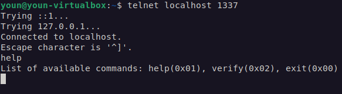
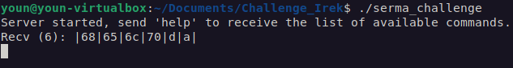
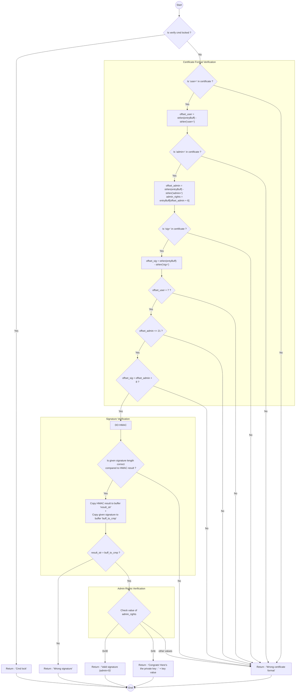
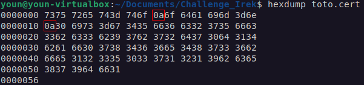

# CTF sent by Irek (11/10/22)

This CTF report is deomposed as follows:
- [CTF Description](#ctf-description)
- [Executing the binary file](#executing-the-binary-file)
- [Exploit and analysis](#exploit-and-analysis)
  - [First analysis](#first-analysis)
    - [The certificate](#the-certificate)
    - [The verify command](#the-verify-command)
  - [Unlocking the verify command](#unlocking-the-verify-command)
    - [Analyzing the binary file](#analyzing-the-binary-file)
    - [Exploit to find the PIN](#exploit-to-find-the-pin)
  - [The verification function](#the-verification-function)
    - [The format verification](#the-format-verification)
    - [The signature verification](#the-signature-verification)
    - [The admin rights verification](#the-admin-rights-verification)
  - [Buffer overflow to modify the admin rights](#buffer-overflow-to-modify-the-admin-rights)
- [TL;DR](#tldr)


## CTF Description
The goal of this challenge is to retrieve a key stored inside a binary that usually run on a server. One way to get it is to verify a certificate with admin rights.

To help you, an inside man stole:
- the binary ('serma_challenge')
- a part of the code ('extract.c') that seems to be the function that performs the certificates verification
- a valid certificate ('toto.cert') with user rights (admin=0 instead of admin=1)

The purpose of this challenge is to evaluate your way to solve this problem (even if you don't succeed it), so please write everything you tried in your report.

## Executing the binary file
### Server side
When executed, the binary `serma_challenge` starts a server. Here's the view in a terminal, after adding execution mode to the binary file (`chmod +x`):


It tolds us that a server has been started, probably on a local port.

### Client side
To know on which port the server is linked, we can analyse all open ports with the command `lsof -i -P -n` :


It shows that this server is on the port 1337.
We can establish a connection to this port with `telnet localhost 1337` and send commands to the server. Here's the returned data from server after sending 'help' command (as sugested):



We now know the different commands avaiable:
- help
- verify
- exit

On the server's side, it just display the command recieved in hexadecimal, with an end sequence (`|d|a|`):



## Exploit and analysis
This section describes the steps I have been through in the chronological order.

### First analysis
#### The certificate
Here's the content of the certificate :
```
user=toto
admin=0
sig=546f2c57cfb33c9bb7277dd041ab0f8764e68437b6ef2153301712b9ec78d91f
```
It said that if we had a certificate with admin rights, we could retrieve the key from the server. To have sush a certificate, the value `admin` should be equal to `1`. But as it is signed, hard writting `admin=1` will not work (because the signature will not match).
> :bulb: Idea : look into the `extract.c` file to analyse how the certificate is verified, and try to find a way to make it accept a 'false admin certificate'

#### The `verify` command

When sending the `verify` command, the server answers `Cmd locked`. This behaviour is due to the certificate verification function described in `extract.c`: the verification function is disabled by a flag (`verify_cmd_locked`), and forbid us to go any further in the certificate verification procedure.

### Unlocking the verify command
#### Analyzing the binary file

By analyzing the file `serma_challenge` with Ghidra, it turns out that another command is avaiable : the command `unlock`. By trying this command we get two different answers from the server:
- `Wrong cmd format (expected format: unlock XXXXXXXX | 0xA5 XXXXXXXX)`
- `Wrong PIN (0)`

This second aswer is get if the command respect the foloxxing formats:
- `unlockXXXXXXX` (the command folowed by 7 characters, most likely a space and 6 characters)
- or `unlockXX`

> :question: Remark: Is accepting this short-version command `unlockXX` an unexpected behavior ? Or is it a feature that we should exploit ?

This function does the following (from re-assembled code):

```c
void unlock(int socket_conn,int lenght_data_received)
{
  [...]
  
  if ((lenght_data_received != 0xf) && (__s = PTR_s_Wrong_cmd_format_(expected_forma_00105130, lenght_data_received != 10)) {
  LAB_00101cdc:
    __n = strlen(__s);
    write(socket_conn,__s,__n);
    return;
  }
  iVar1 = (uint)(lenght_data_received == 0xf) * 5;
  if ((int)DAT_001050d0 == (uint)(byte)(&input_buff_slot)[iVar1 + 2]) {
    if ((int)DAT_001050d1 == (uint)(byte)(&input_buff_slot)[iVar1 + 3]) {
      if ((int)DAT_001050d2 == (uint)(byte)(&input_buff_slot)[iVar1 + 4]) {
        if ((int)DAT_001050d3 == (uint)(byte)(&input_buff_slot)[iVar1 + 5]) {
          if ((int)DAT_001050d4 == (uint)(byte)(&input_buff_slot)[iVar1 + 6]) {
            if ((int)DAT_001050d5 == (uint)(byte)(&input_buff_slot)[iVar1 + 7]) {
              if ((int)DAT_001050d6 == (uint)(byte)(&input_buff_slot)[iVar1 + 8]) {
                cVar6 = '\a';
                if ((int)DAT_001050d7 == (uint)(byte)(&input_buff_slot)[iVar1 + 9]) {
                  verify_cmd_locked = 0;
                  __s = PTR_s_Cmd_unlocked_00105140;
                  goto LAB_00101cdc;
                }
  [...]
}
```
It beahavior is quite simple, it verifies that the length of the given data is 15 or 10, and if not it prints an error message.
If this first step is passed, it checks if the input data correspond to pre-defined values (`DAT_001050dX`) and if so, it toggles the flag `verify_cmd_locked` to `0` before printing the message `Cmd unlock`.

> :warning: **Mistake**
> 
> As it performs 8 checks, I first assumed that it expect an input data constructed as follows:
> - `unlock` command (6 characters)
> - separation element, can be a space (1 character)
> - PIN with 6 characters
> - final characters `0xd` and `0xa` (2 characters)
>
> But the characters `0xd` and `0xa` were only due to telnet, that sends the command to the server when I typed `return`.
> By using a python script, I can construct myself the structure of the command, and send a 8-long PIN (which is more likely what the server expects)


Anyway, the input `unlockXX` seems to not be the expected input.


Here are the pre-defined values given by Ghidra:
```
DAT_001050d0 = 96h
DAT_001050d1 = 97h
DAT_001050d2 = 93h
DAT_001050d3 = 96h
DAT_001050d4 = 94h
DAT_001050d5 = 97h
DAT_001050d6 = 93h
DAT_001050d7 = 98h
```

The expected data seem to be the following:
`|75|6e|6c|6f|63|6b|20|96|97|93|96|94|97|93|98|`

> :bulb: Idea : Use a script to send these specific hexa values to the server

#### Exploit to find the PIN

I have tried to unlock the `verify` command by sending specific hexa values to the server. I sent the command `unlock \x96\x97\x93\x96\x94\x97\x93\x98` but it didn't work. It looks like the values described in the previous section are not the exact values wanted by the server.

> :bulb: Idea : The input buffer is pre-processed somewhere before the PIN is verified, or the values given by Ghidra are obfuscated in the code.
> 
> Two possibilities :
> - reversing the code more deeply to find any modification applied to the input buffer
> - using a debugger step by step to find any modification applied to the input buffer

> :bulb: Other approach : brute-forcing the PIN

I chose to try a brute-forcing method.
Assuming that the PIN only uses alpha-numerical characters (both with capital and lowercase letters), there is 65^8 possibilities, which is to much to test them all.

But thanks to the values given by Ghidra, I can make another asumption:

Let's call the PIN's characters values (in ASCII) with letters: ABCDEFGH. If the obfuscating method is linear, the values from Ghidra enable me to say that:
- the lower value is C (and G because C = G)
- A = D = C+3
- B = F = C+4
- E = C+1
- H = C+5
- G = C

This gives me a patern that makes the brute-forcing tests a lot faster. With a python script, I tested all the possibilities based on these assumptions and I found the correct PIN: `DEADBEAF` :partying_face:

After having unlocked the verify command, the servers now answers `Wrong certificate format` (to the command `verify`).

### The verification function

From the source code (and a string analysis with Ghidra), we can get the execution graph of the certificate verification procedure (if the mermaid code is not correctly interpreted, you can find the graph in the folder *img* of this repo):


This procedure is decomposed in three parts:
- The format verification
- The signature verification
- The admin rights verification

#### The format verification

This parts ensures that the strings `user=`, `admin=` and `sig=` are present in the certificate.

Then, it does checks on the different offset values that can be interpreted as follows:
- the string `user=` must start 7 characters after the begining (check `offset_user = 7`). This means that there must be an espace, or any separation character, after the command `verify` (because "verify" is only 6 characters long).
- the string `admin=` must not be 22 characters or more away from the begining (check `offset_admin <= 21`). This means that the given username must be maximum 8 characters long ("verify"(6) + separation(1) + "user="(5) + username(8) + separation(1) = 21 characters)
> :question: Remark : How is interpreted the separation character after the username ? Nothing seems to indicate that it cannot be part of this username...
- the string `sig=` must be 8 characters after the begining of the string `admin=` (check `offset_sig = offset_admin + 8`). This means that the value given after `admin=` should be on 1 character only (if we consider that it is followed by a separation character)

#### The signature verification

This parts checks is the given signature correspond to the given certificate signed.

> :warning: Mistake :
> 
> I had a lot of struggle making the correct certificate being accepted by the server (see section [*"The certificate"*](#the-certificate)).
> 
> This was because I was sending the command `verify user=toto admin=0 sig=546f2c57cfb33c9bb7277dd041ab0f8764e68437b6ef2153301712b9ec78d91f` and I had the result `Wrong signature`. But an hexdump analysis (picture below) on the given certificate shows that the separation characters should be `\n` (encoded `0x0a`) and not a SPACE. Indeed, the given signature is not valid if the separation characters are not respected.
> 
> 

With the given certificate `toto.cert`, we should send the following command : `verify user=toto\x0aadmin=0\x0asig=546f2c57cfb33c9bb7277dd041ab0f8764e68437b6ef2153301712b9ec78d91f`. Note that the space character between `verify` and `user=` can be replaced by anything (but a separation character should be present).

When receiving this command, the server answers `Valid signature (admin=0)`

#### The admin rights verification

By default, the admin rights are set to `0x30`. To display the hidden key they must be set at `0xfe`. To modify this value, I used a buffer overflow method.

### Buffer overflow to modify the admin rights

During the verification procedure, the signature passed in the command is brutally copied into the array `buff_to_cmp`. At the begining of `extract.c` file, we see that this array is declared right after `admin_rights` (code below).

```c
void verify(int connexion, int size)
{
	[...]
  
	unsigned char cmp_sig = 1;
	unsigned char admin_rights = 0x30;
	unsigned char buff_to_cmp[WORKING_BUFFER_SIZE];
	unsigned char result[WORKING_BUFFER_SIZE];
	unsigned char result_str[WORKING_BUFFER_SIZE];
	unsigned char to_send[256];

	memset(buff_to_cmp, 0, WORKING_BUFFER_SIZE);
	memset(result, 0, WORKING_BUFFER_SIZE);
	memset(result_str, 0, WORKING_BUFFER_SIZE);
	memset(to_send, 0, 256);
  
  [...]
```

By adding a lot off data after the signature, the copy will overwrite the value of `admin_rights` in the memory. Moreover, the signature comparaison is only made on 64 bytes, so the additional data will not be considered by the verification procedure.

Testing this buffer overflow with zero padding, it turns out that it is the 16th byte that has an impact on the verification procedure's result (`Wrong certificate format` instead of `Valid signature (admin=0)`, see the verification procedure graph).

Changing the 16th byte by `0xfe` overwrites `admin_rights` with the expected value and gives us the flag : `Congrats! Here's the private key :\n superprivatekey\n` :partying_face:

# TL;DR
