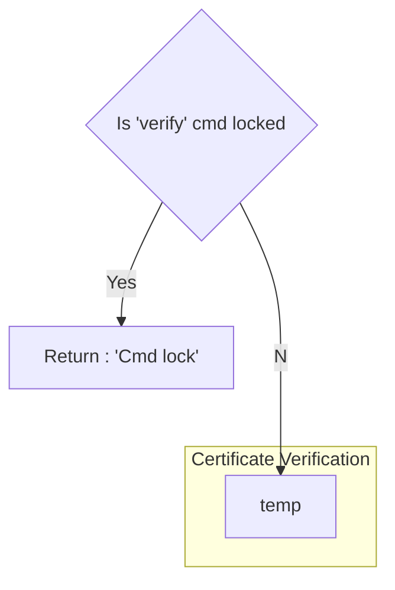

# CTF sent by Irek (11/10/22)

This CTF report is deomposed as follows:
- [CTF Description](#ctf-description)
- [Executing the binary file](#executing-the-binary-file)
- [Exploit and analysis](#exploit-and-analysis)
  - [First analysis](#first-analysis)
    - [The certificate](#the-certificate)
    - [The verification function](#the-verification-function)
  - [Unlocking the verify command](#unlocking-the-verify-command)
    - [Analyzing the binary file](#analyzing-the-binary-file)
    - [Exploit to find the PIN](#exploit-to-find-the-pin)


## CTF Description
The goal of this challenge is to retrieve a key stored inside a binary that usually run on a server. One way to get it is to verify a certificate with admin rights.

To help you, an inside man stole:
- the binary ('serma_challenge')
- a part of the code ('extract.c') that seems to be the function that performs the certificates verification
- a valid certificate ('toto.cert') with user rights (admin=0 instead of admin=1)

The purpose of this challenge is to evaluate your way to solve this problem (even if you don't succeed it), so please write everything you tried in your report.

## Executing the binary file
### Server side
When executed, the binary `serma_challenge` starts a server. Here's the view in a terminal, after adding execution mode to the binary file (`chmod +x`):


It tolds us that a server has been started, probably on a local port.

### Client side
To know on which port the server is linked, we can analyse all open ports with the command `lsof -i -P -n` :


It shows that this server is on the port 1337.
We can establish a connection to this port with `telnet localhost 1337` and send commands to the server. Here's the returned data from server after sending 'help' command (as sugested):


We now know the different commands avaiable:
- help
- verify
- exit

On the server's side, it just display the command recieved in hexadecimal, with an end sequence (`|d|a|`):


### The `verify` command

When sending the `verify` command, the server answers `Cmd locked`. This behaviour seems to be due to the certificate verification function described in `extract.c`. More information about this function in the section below.

## Exploit and analysis
This section describes the steps I have been through in the chronological order.

### First analysis
#### The certificate
Here's the content of the certificate :
```
user=toto
admin=0
sig=546f2c57cfb33c9bb7277dd041ab0f8764e68437b6ef2153301712b9ec78d91f
```
It said that if we had a certificate with admin rights, we could retrieve the key from the server. To have sush a certificate, the value `admin` should be equal to `1`. But as it is signed, hard writting `admin=1` will not work (because the signature will not match).
> :bulb: Idea : look into the `extract.c` file to analyse how the certificate is verified, and try to find a way to make it accept a 'false admin certificate'

#### The verification function

From the source code, we can get the execution graph of the certificate verification procedure:


The verification function is disabled by a flag (`verify_cmd_locked` in `extract.c`), and forbid us to go any further in the certificate verification procedure.

### Unlocking the verify command
#### Analyzing the binary file

By analyzing the file `serma_challenge` with Ghidra, it turns out that another command is avaiable : the command `unlock`. By trying this command we get two different answers from the server:
- `Wrong cmd format (expected format: unlock XXXXXXXX | 0xA5 XXXXXXXX)`
- `Wrong PIN (0)`

This second aswer is get if the command respect the foloxxing formats:
- `unlockXXXXXXX` (the command folowed by 7 characters, most likely a space and 6 characters)
- or `unlockXX`

> :question: Remark: Is accepting this short-version command `unlockXX` an unexpected behavior ? Or is it a feature that we should exploit ?

This function does the following (from re-assembled code):

```c
void unlock(int socket_conn,int lenght_data_received)
{
  [...]
  
  if ((lenght_data_received != 0xf) && (__s = PTR_s_Wrong_cmd_format_(expected_forma_00105130, lenght_data_received != 10)) {
  LAB_00101cdc:
    __n = strlen(__s);
    write(socket_conn,__s,__n);
    return;
  }
  iVar1 = (uint)(lenght_data_received == 0xf) * 5;
  if ((int)DAT_001050d0 == (uint)(byte)(&input_buff_slot)[iVar1 + 2]) {
    if ((int)DAT_001050d1 == (uint)(byte)(&input_buff_slot)[iVar1 + 3]) {
      if ((int)DAT_001050d2 == (uint)(byte)(&input_buff_slot)[iVar1 + 4]) {
        if ((int)DAT_001050d3 == (uint)(byte)(&input_buff_slot)[iVar1 + 5]) {
          if ((int)DAT_001050d4 == (uint)(byte)(&input_buff_slot)[iVar1 + 6]) {
            if ((int)DAT_001050d5 == (uint)(byte)(&input_buff_slot)[iVar1 + 7]) {
              if ((int)DAT_001050d6 == (uint)(byte)(&input_buff_slot)[iVar1 + 8]) {
                cVar6 = '\a';
                if ((int)DAT_001050d7 == (uint)(byte)(&input_buff_slot)[iVar1 + 9]) {
                  verify_cmd_locked = 0;
                  __s = PTR_s_Cmd_unlocked_00105140;
                  goto LAB_00101cdc;
                }
  [...]
}
```
It beahavior is quite simple, it verifies that the length of the given data is 15 or 10, and if not it prints an error message.
If this first step is passed, it checks if the input data correspond to pre-defined values (`DAT_001050dX`) and if so, it toggles the flag `verify_cmd_locked` to `0` before printing the message `Cmd unlock`.

> :warning: **Mistake**
> 
> As it performs 8 checks, I first assumed that it expect an input data constructed as follows:
> - `unlock` command (6 characters)
> - separation element, can be a space (1 character)
> - PIN with 6 characters
> - final characters `0xd` and `0xa` (2 characters)
>
> But the characters `0xd` and `0xa` were only due to telnet, that sends the command to the server when I typed `return`.
> By using a python script, I can construct myself the structure of the command, and send a 8-long PIN (wich is more likely what the server expects)


Anyway, the input `unlockXX` seems to not be the expected input.


Here are the pre-defined values given by Ghidra:
```
DAT_001050d0 = 96h
DAT_001050d1 = 97h
DAT_001050d2 = 93h
DAT_001050d3 = 96h
DAT_001050d4 = 94h
DAT_001050d5 = 97h
DAT_001050d6 = 93h
DAT_001050d7 = 98h
```

The expected data seem to be the following:
`|75|6e|6c|6f|63|6b|20|96|97|93|96|94|97|93|98|`

> :bulb: Idea : Use a script to send these specific hexa values to the server

#### Exploit to find the PIN

I have tried to unlock the `verify` command by sending specific hexa values to the server. I sent the command `unlock \x96\x97\x93\x96\x94\x97\x93\x98` but it didn't work. It looks like the values described in the previous section are not the exact values wanted by the server.

> :bulb: Idea : The input buffer is pre-processed somewhere before the PIN is verified, or the values given by Ghidra are obfuscated in the code.
> 
> Two possibilities :
> - reversing the code more deeply to find any modification applied to the input buffer
> - using a debugger step by step to find any modification applied to the input buffer

> :bulb: Other approach : brute-forcing the PIN

I chose to try a brute-forcing method.
